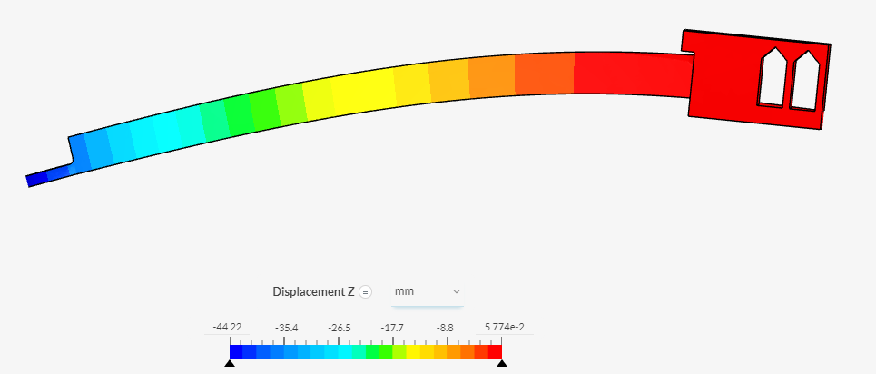
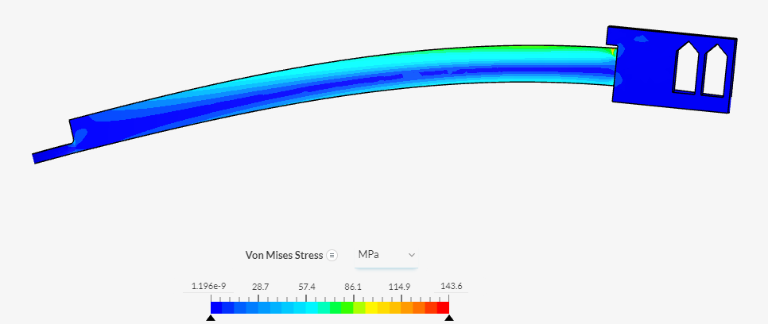

# FEA- Assignments 

### FEA Part 2
# Deflection

The beginning of the block is really bendy and I don't know if that's good or bad but it seems very stable at the end where it's blue. BUt that's also a weak point as we don't know how much it can hold, we also think that the the little sicrle at the end might break off.
# Force

For the force, on the top of the trianlge it's very red which indicates that it's a weak point and probably one of the parts that're going to break. Also all along the top part it's green and and looks very weak, We're probably going to just make it better and stronger whether or not that's going to make a difference. For the redesigned we're going to add a triangle to help make the top part stronger so the redness going away.
# Deflection (test 2)

The deflection has stayed the same but I feel like it's gotten better and won't break that easily. I don't if it's better to be really bendable because ours isn't that bendable but I think it's good to havbe a sturdy beam and that's what we created.
# Force (Test 2)

There was a bunch of red on the top part of the beam but we changed it by adding a triangle to it. By adding this triangle we reduced the amount of redness and the top part is mosty green now. Which means that the beam should be more sturdy and stiff and won't break as easy.

# Link to the onshape
[Onshape](https://cvilleschools.onshape.com/documents/d1f3a9e9215f9317fa185fb8/w/0a8716364b546bc727f41c6e/e/d0a2d7a2935745fb9d8c59f6)
